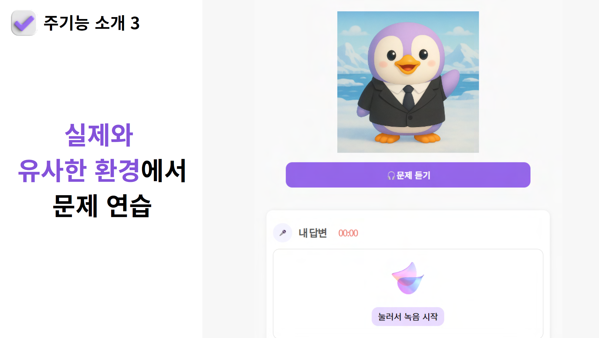
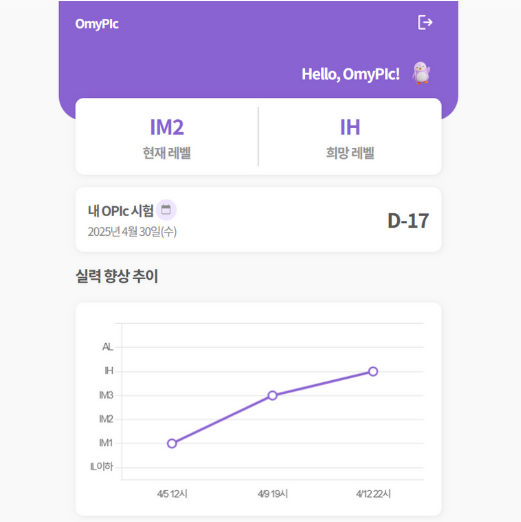

# 목차
1. [기획 배경](#기획-배경)
3. [서비스 목표](#서비스 목표)
4. [주요기능](#주요기능)
5. [화면소개](#화면소개)
6. [프로젝트 성과](#프로젝트-성과)
7. [서비스 아키텍처](#서비스-아키텍처)
8. [기술 설명](#기술-설명)
9. [ERD](#ERD) 
10. [명세서(기능, API, 요구사항)](#명세서)
11. [유저 플로우](#유저-플로우)
12. [화면 정의서](#화면-정의서)
13. [담당 역할](#담당-역할)
---

# OmyPIc : 오직 나만을 위한 오픽 학습 서비스, 오마이픽 
오픽 시험을 앞둔 사용자를 대상으로 맞춤형 영어 대본을 생성하고, 실전과 유사한 테스트 환경을 제공하는 학습 서비스 

  

## 개발 기간
2025.03.03~2025.04.11(6주)

## 기획배경

  

1. <b>설문조사를 통한 사용자 니즈 파악(3/4~3/6)<b> 
  - 취업준비생 153명 대상 오픽 학습 서비스에 대한 수요, 학습에서 가장 어려운 점 조사

2. <b>사용자 니즈 도출<b>
  - 영어로 대본 작성하는 것이 어렵다 
  - 실제 시험과 유사한 형태로 연습하고, 예상 등급을 받아보고 싶다  

## 서비스 목표
1. 한국어로 답변하면 사용자의 희망 성적 수준에 맞는 영어 스크립트를 생성해 학습 보조
2. 실전 테스트 기능을 중심으로 실력 진단 및 향상 지원

## 주요기능
### 1. 개인 경험 기반 맞춤형 스크립트 작성 
- 한/영 응답 기반으로 Gemini AI를 통해 IH~AL 수준 영어 스크립트 생성

  
  

 

### 2. 실전과 유사한 테스트 환경 제공 
- 실전(15문제), 유형별(콤보셋/롤플레잉/돌발), 한 문제로 세 가지 유형 테스트 제공

  

### 3. 사용자 답변(음성) 평가 
- Whisper AI로 사용자 응답을 STT 처리하고, Gemini AI를 통해 오픽 성적 채점 기준에 따라 사용자 응답에 대한 점수 및 피드백 제공

 
  

 

## 화면소개
### 1. 로딩 및 서비스 소개 화면 
   1) 생성형 AI로 생성한 캐릭터 '오피기': 친근감, 부드러운 느낌 강화  
   2) 서비스 소개 화면: 처음 서비스를 접하는 유저를 위해 핵심기능을 요약하여 전달 

  

 

### 2. 회원 정보 입력 화면
   1) 맞춤형 학습을 위해 희망등급/현재등급/시험예정일/정보 활용 동의 정보 입력 

  

 

### 3. 백그라운드 서베이(사용자 맞춤형 질문 셋팅) 화면 
   1) 실제 오픽 시험에서는 백그라운드 서베이 기반 출제되기에 유사한 환경 제공하고자 서베이 제공
   2) 서베이 선택 팁 명시하여 매끄러운 학습 환경 셋팅 지원  

  

 

### 4. 메인 화면 
   1) 현재레벨/희망레벨/시험예정일/실력 향상 추이 시각화 제공하여 지속적 학습 장려 

  

 

### 5. 스크립트 생성 페이지 
   1) 실전에서 제공되는 주제별 유저가 선택하여 맞춤형 질문 연습 제공 
   2) 기출문제 기반 개인 경험 기반 맞춤형 스크립트 생성 제공 

  
  

  
  

   3) 로딩 화면에 애니메이션, 답변 Tip 명시하여 이탈 가능성 완화 
   4) 스크립트 보완 희망시 디테일 추가 가능하도록 AI 스크립트 보완 기능 제공 

 

### 6. 실전연습 메인 페이지 
   1) 실전연습(테스트 응시) 메인에서 시험유형 선택/유형별 나의 평균 등급 시각화/지난 응시 기록 제공하여 지속 학습 독려 

  

 

### 7. 실전연습 응시 페이지 
   1) 설문조사 니즈에 따라 '실전과 유사한 환경' 재현하여 반복 연습 환경 제공 

  

 

### 8. 예상등급 및 피드백 페이지  
   1) 종합(각 부문별 보완사항) 피드백 제공하여 상세 가이드 제공
   2) 설문조사 니즈에 따라 개별 피드백으로 '예상등급/문단구성/어휘력/발화량 평가' 기반 개인 솔루션 제공  

  

 

## 프로젝트 결과 
1. 피드백 기반 개선 결과 및 유저 피드백
- 4/15일 기준 2차 배포 이후 136명의 유저 확보
- 2차 배포 후 유저 피드백 
- 1) 개선점 및 기능에 관한 피드백: "1, 3문제 테스트가 생겨 부담 없이 사용하기 좋고, 예상점수를 알 수 있어서 유용하다."
- 2) 교내 커뮤니티 배포 후 교우 피드백 : 유료 버전 이용 의사 확인

  
  

2. 프로젝트 효과성
- 오픽 시험 응시 경험이 없는 사용자: 스크립트 생성 기능과 실전 모의고사를 활용해 8일간 30분 동안 꾸준히 학습
- 서비스 일 차 대비 일 차에는 문단 구성력표현력발화 길이가 모두 향상되어 예상 등급 상승(IM1 → IM3)
- 4/8(화) 실제 오픽 시험 응시하여 목표 등급(IH) 달성

  
  
  

3. 삼성 청년 SW 아카데미 공모전 전체 70명-11팀 중 우수상(2등) 수상 
-  창의성/실현가능성/기술 활용도 측면에서 수상 

## 서비스 아키텍처

  

## 기술 설명 
1. <b>Infra<b> 
- '업데이트시 서버 끊겨 불편하다'는 유저 피드백에 따라 블루그린 배포 도입하여 서비스 연속성 유지 

    

 

2. <b>Frontend<b>
- 사용자 행동 패턴 분석 도구 Hotjar 활용하여 UI/UX 개선에 적극 활용

    
    

3. <b>Backend<b>
- Celery와 Redis 도입하여 원어민 음성 생성 로직 서버 부하 감소
- Fast API 서버 내부 Background Tasks는 트래픽에 따른 병목 발생, 작업 실패시 재시도 불가
- 서버 외부, 우선순위 작업 큐에 따라 작업 실행하는 비동기 처리 방식으로 해결  
- 이로써 메모리 사용량 1/5 수준(25MB -> 5MB) 감소 확인

    
    
    
    

4. <b>AI<b> 
- 억양, 발음 등 공식 평가 기준에 따라 이를 학습할 수 있도록 고품질 생동감 있는 원어민 음성 제공  
- sesame 모델 선택 기준 
  - 자연스럽고 생동감 있는 음성 구현 능력
  - 상업적 활용 라이선스 보유 여부
  - 향후 온디바이스 적용시 운영 지원 가능성  

    

- sesame 활용 로직 
  - sesame 모델은 생동감이 있으나 생성시간의 한계 존재
  - gtts는 빠른 생성 시간 특장점이 있어, 두 모델 결합하여 생성시간 약 83% 단축 

    
      

## ERD

  

## 명세서
### 1. 기능 명세서

  

### 2. API 명세서

  

### 3. 요구사항 명세서

  

## 유저 플로우

  

## 화면 정의서

  

## 담당 역할

| 이름 | 역할 | 담당 업무 |
| --- | --- | --- |
| **김의중** | BE, Infra | - Spring Security, JWT, OAuth를 이용해 소셜로그인 및 회원가입 구현 (인증, 인가) - 회원 마이페이지 CRUD 기능 구현 - JPA를 이용하여 API 개발 - Redis를 이용하여 인증토큰 관리 및 추천화장품, 성분분석정보 캐싱 - EC2, Jenkins, Dokcer, Nginx, GitLab을 이용하여 무중단 배포서버 구축 - 인증서를 이용하여 https 구현 - Nginx로 리버스프록시 사용 (/api, /, /recommend, /ocr) - 스프링부트 서버에서 성분 분석 알고리즘 구현 |
| **김세림** | BE, Data | - BeautifulSoup, Selenium을 이용한 화장품 데이터 크롤링 - 화장품 성분 및 평점 데이터 수집 - 성분명 전처리 진행 - DB 초기 데이터 정제 및 AWS S3 이미지 url 연동 - 리뷰 페이지 CRUD 구현 - AWS S3을 이용한 이미지 업로드 기능 구현 |
| **오한나** | FE | - 서비스 디자인(Figma) - 메인페이지, 상품 상세 페이지, 리뷰 등록, 소개 페이지 구현 - 검색 팝업창(화장품/성분 등록/수정 기능) 구현 - 리뷰 등록, OCR, 관리자페이지에서 사용하는 이미지 업로드, 미리보기 컴포넌트 구현 - 회원정보폼 구현 마무리 - css 초기 설정 및 반응형 설정 |
| **이태우** | BE | - 서비스 디자인(Figma) - JPA를 이용하여 API 개발 - 스프링부트 서버에서 검색 정렬 알고리즘 구현 - 디바운싱 기반 화장품과 성분명 자동 완성 알고리즘 구현 - 화장품 상세 페이지 |
| **전혜준** | FE | - Redux 전역 상태 관리 시스템 구축 - TanStack Query와 Axios 기반 비동기 데이터 처리 - 실전연습 기능 구현(학습 콘텐츠 유형 3가지, 사용자 답변 녹음, 예상등급 및 피드백 평가, 유저 학습 그래프 시각화) - CSS 활용한 인터랙티브 UI/UX 개발 - Figma 화면정의서 & 유저플로우 & api 명세서 지속적 업데이트 |
| **황대규** | BE, FE, Data | - 로그인, 회원가입, 초기 회원 정보 입력 폼 페이지 구현 - 관리자 신고 받은 리뷰 확인 및 ocr 기반 화장품 등록 페이지 구현 - 관리자 페이지 CRUD 구현 - clova ocr모델과 open ai api를 활용, ocr 데이터 처리 - 코사인 유사도, 하이브리드 추천 시스템을 활용한 추천 알고리즘 구현 |
